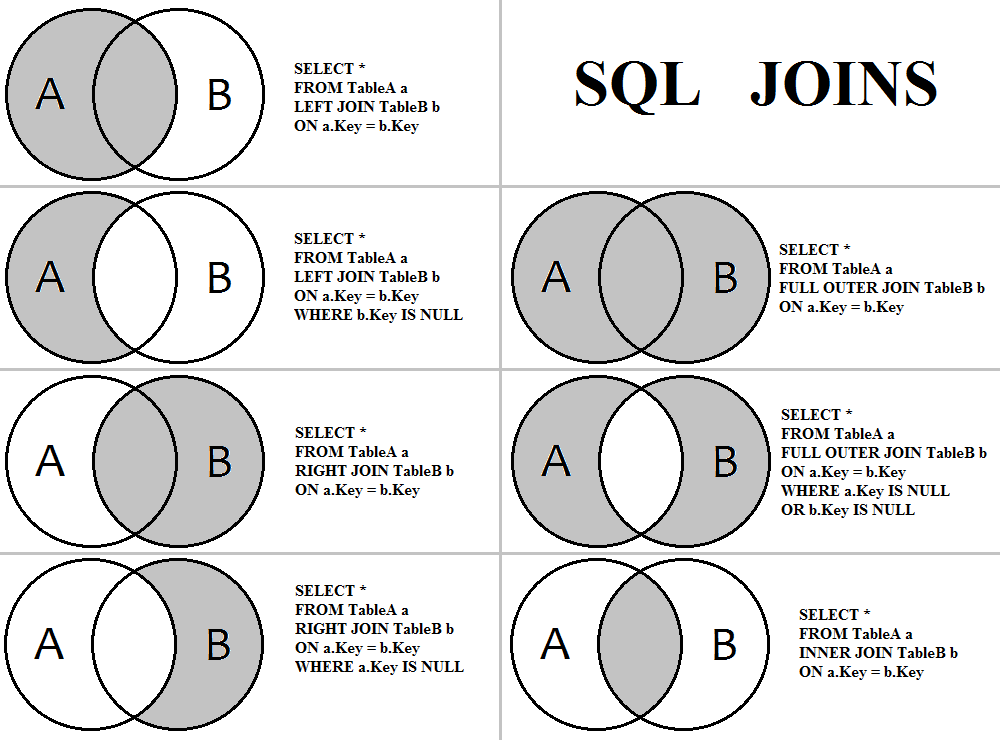

# SQL training - day 3 : JOIN

## 복습
1. 함수의 사용 -> maria db reference 잘 활용할 것
2. ORDER BY -> 결과를 정렬
3. DISTINCT -> 결과에서 중복을 제거
4. GROUP BY -> 집계함수를 특정 컬럼에 대해 실행

***

## JOIN 에 대한 비유
두 개의 서류철을 겹쳐놓고 보는 상황   

예 : 인사기록철 과 건강검진기록철을 각 사람 별로 매칭을 시켜놓고 내용을 본다.   
* 이름과 생년월일이 동일한지를 이용해서 매칭을 시킨다.
```
ON left_table.name = right_table.name and left_table.birthday = right_table.birthday
```
* 인사기록철에 있는 총 근무 시간과 건강검진기록철에 있는 건강 상태 사이의 상관 관계를 파악한다.
  


***
## INNER JOIN (그냥 JOIN 이라고 하면 이것을 의미)
left_table(인사기록철) 과 right_table(건강검진기록철) 모두 데이터가 일치하는 경우만 조회한다. 즉, 노타 직원 중에 건강검진을 받은 사람들만 조회된다.
ON 에는 join 조건들이 들어감
```
SELECT
    np_user.user_id,
    np_user.username,
    np_ta_ma.task_name,
    np_ta_ma.is_active
FROM nptk.users as np_user
JOIN nptk.task_master as np_ta_ma
ON np_user.user_id = np_ta_ma.user_id 
```
***
## LEFT JOIN 
건강검진을 받지 않은 사람의 경우 인사기록철에는 서류가 있지만 건강검진기록철에는 서류가 없다.
이런 사람도 함께 조회하는 경우이다. 건강검진을 받지 않은 사람은 건강검진과 관련된 칸이 공란(NULL)이 된다.
```
SELECT
    np_user.user_id,
    np_user.username,
    np_ta_ma.task_name,
    np_ta_ma.is_active
FROM nptk.users as np_user
LEFT JOIN nptk.task_master as np_ta_ma
ON np_user.user_id = np_ta_ma.user_id 
```
***
## RIGHT JOIN
가족 찬스로 건강검진을 받은 경우에는 노타 인사기록철에는 직원의 가족 서류가 없지만 건강검진기록철에는 서류가 있다.
이런 사람도 함께 조회하는 경우이다. 직원 가족들의 경우 인사기록과 관련된 칸이 공란이 된다.

```
SELECT
    np_user.user_id,
    np_user.username,
    np_ta_ma.task_name,
    np_ta_ma.is_active
FROM nptk.users as np_user
RIGHT JOIN nptk.task_master as np_ta_ma
ON np_user.user_id = np_ta_ma.user_id 
```
***
## OUTER JOIN
모든 노타 직원과 건강검진을 받은 직원 가족들까지 모두 조회한다. LEFT JOIN 과 RIGHT JOIN 을 UNION 한 것과 같다. 실제로 maria db 에는 OUTER JOIN 이 없어서 LEFT JOIN 과 RIGHT JOIN 을 각각 한다음 이를 UNION 해야 OUTER JOIN 결과가 나온다.
```
SELECT
    np_user.user_id,
    np_user.username,
    np_ta_ma.task_name,
    np_ta_ma.is_active
FROM nptk.users as np_user
LEFT JOIN nptk.task_master as np_ta_ma
ON np_user.user_id = np_ta_ma.user_id
UNION
SELECT
    np_user.user_id,
    np_user.username,
    np_ta_ma.task_name,
    np_ta_ma.is_active
FROM nptk.users as np_user
RIGHT JOIN nptk.task_master as np_ta_ma
ON np_user.user_id = np_ta_ma.user_id 
```
***
## 자기자신과의 JOIN
중복이 있는 컬럼을 key 로 JOIN 하는 경우   
여러 가지 꼼수를 부릴 수 있다.   


***
## 예제
* 각 유저(user_id) 가 어떤 compression_method 를 몇 번 씩 사용했는지 조회하라.
* 각 유저 별로 가장 많이 사용한 compression_method 의 종류가 무엇인지 조회하라.
* 각 유저 별로 task 생성 간의 시간 간격의 평균 값을 구하라. (각 user 가 얼마만에 한 번 씩 task 를 생성하는지 알고 싶다.) - 자기자신과의 JOIN을 잘 이용해보자
  
